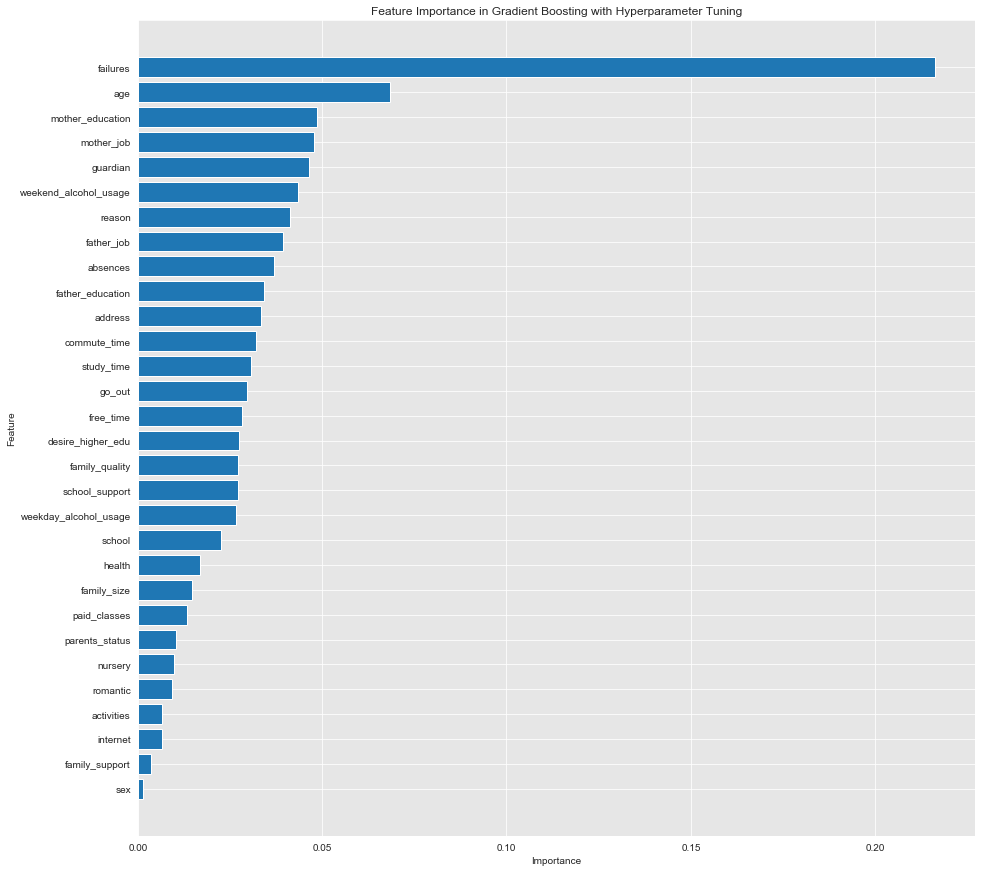

# Prediction_on_students_performance

### INTRODUCTION

The main goal of this project is to use data collected from students in two schools in Portugal to see whether or not it is possible to predict if a student will fail or pass a course. Using classifications algorithms, I will predict the final score that the student receives. The classification methods that I am going to use in my analysis are: logistic regression, k-nearest neighbors, decision tree, Random Forest, Gradient Boots and Ada boots. To evaluate my results, I will implement confusion matrices, accuracy, recall, precision and F1 score for each of my classifiers. 

## Goal

The aim of this project is to use data collected from students in two schools in Portugal to see whether or not it is possible to predict if a student will fail or pass a course using data mining.

### DATASET

The data “Student Performance” can be found in the University of California public repository:(https://archive.ics.uci.edu/ml/datasets/student+performance). 

The dataset contains two tables one form the math course and another form the portuguese course. I merged these two tables so I can have more data for my analysis.

A few characteristics of my data set are:

- It has 1044 entries and 33 features.
- Most of my features are categorical values which needs to be encoded for the classification analysis.
- The dataset consists of demographic, social and economic characteristics of a student.

### TARGET FEATURE

My target feature is final score feature. It contains numeric values, that needed to be econde as a categorical values for my analysis. The range of  this feature was from zero to twenty. I divided it form zero to teen as fail and from 10 to twenty as pass. I have around 24 % of students that didn't pass the course and 77% of students that pass the course and as a consequence I have class imbalance.

### EXPLORATORY DATA ANALYSIS 

###  DATA MINING ALGORITHMS

To model my data, I used logistic regression, k-nearest neighbors and Decision tree classifier. First I implement each classifier with default parameters, then I turned the parameters for each classifier. After that,  the accuracy and the F1 score of each classifier increased by around 5%to 8%. However, none of these models were very strong. After, I tried ensembles methods
because I knew that they will increase the accuracy rate and the F1 score. The ensembles that I used were: Random Forest, Gradient Boost and Ada boots. I used the same method, I implement the ensembles with their default parameters first and after I tuned their parameters. Same as the classifiers, the accuracy rate and the F1 score increased after I tuned their parameters.

### EVALUATION METRICS

 To evaluate my results, I  implement confusion matrix, accuracy, recall, precision and F1 score for each of my classifiers.

### RESULTS

The classifier with higher Accuracy and F1 score was Gradient Boosting with a 88.02% accracity rate and a 89.16% of F1 score. 

I also plot the feature importance of this model and found that failures was the most important feature. This makes a lot of sense when considering if a student fails or passes a course based on the number of previous class failures.

### FUTURE APPLICATIONS 
Having the ability to predict whether or not a student will fail a course using these tools may be beneficial to prevent student failure and to make an intervention. In addition, since my data set is from two schools in Portugal, I would like to find more data from other countries so I can make a global prediction. Also, I would like to make another
model to predict classification with multiple labels( poor, fair and good). Finally, I would like to make a linear regression model since my target value is numeric and see if the results will change.

